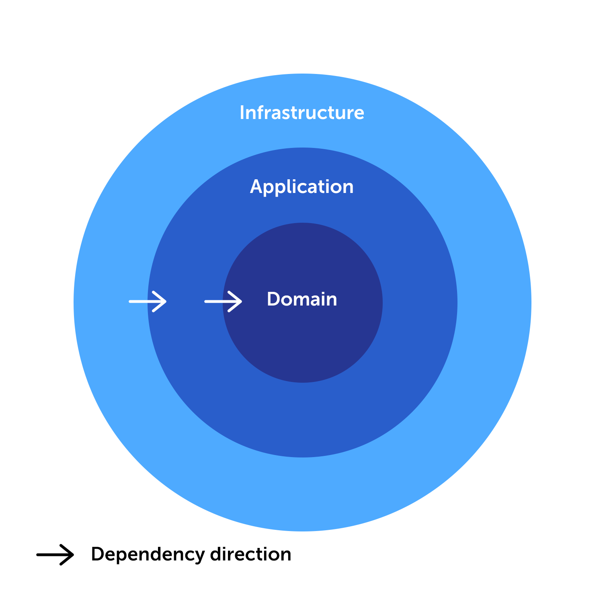

# API Brain Agriculture

A API do projeto Brain Agriculture foi projetado em **Clean Architecture** desenvolvido com NestJS e NodeJS. Este projeto oferece um modelo abrangente e modularizado, demonstrando uma arquitetura bem estruturada e fácil de manter para suas aplicações.

## Introdução

O principal objetivo deste projeto é demonstrar como criar uma estrutura de aplicação escalável e modular utilizando o robusto conceito da Clean Architecture e SOLID. Essa arquitetura promove a separação de responsabilidades e estabelece uma distinção clara entre as diferentes camadas da sua aplicação. O foco principal é isolar a regra de negócio, garantindo que ela permaneça independente de aspectos técnicos e externos, o que facilita a manutenção, a escalabilidade e a evolução da aplicação.

## Visão Geral da Clean Arquitetura

A aplicação segue a **Clean Architecture**, que consiste em três camadas principais:

1. **Camada de Infraestrutura (infrastructure)**: Responsável por gerenciar todas as entradas e saídas de dados da aplicação. Isso inclui a comunicação com bancos de dados, APIs RESTful, sistemas de mensageria, e outras integrações com serviços externos. Garantindo que a regra de negócio permaneça isolada na camada de aplicação, enquando lida com os aspectos técnicos e operacionais da aplicação.

2. **Camada de Aplicação (application)**: Focada em isolar a regra de negócio das demais camadas, garantindo que mudanças em bibliotecas, frameworks ou outras dependências técnicas não afetem a lógica central da aplicação. Para alcançar essa separação, a camada de aplicação se comunica com a camada de infraestrutura exclusivamente por meio de interfaces, seguindo os princípios de SOLID. Essa abordagem assegura que a aplicação permaneça modular, fácil de manter e resiliente a mudanças tecnológicas.

3. **Camada de Domínio (domain)**: Esta camada é focada em toda a estrutura de dados da aplicação, como DTOs, entidades, interfaces e outros elementos essenciais, seguindo os princípios do Domain-Driven Design (DDD). Ele é independente de qualquer outra camada e inclui entidades, objetos de valor, agregados e serviços de domínio. Essa independência garante que a lógica de negócio permaneça intacta e desacoplada de implementações técnicas.



## Regras de Dependência (Dependency direction)

Para manter uma arquitetura limpa e bem estruturada, seguimos as seguintes regras de dependência:

- **Camada de Infraestrutura**: A camada de infraestrutura pode depender tanto da Camada de Aplicação quanto da Camada de Domínio, permitindo a implementação das interfaces definidas nas camadas internas.

- **Camada de Aplicação**: A camada de aplicação pode depender da Camada de Domínio para acessar e utilizar a lógica de domínio, a fim de atender aos casos de uso.

- **Camada de Domínio**: A lógica central de domínio não deve depender de nenhuma outra camada, mantendo-a desacoplada e reutilizável.

## Comandos para executar no projeto

### Instalação do pacote NPM

```bash
$ npm install
```

### Executar o projeto

```bash
# desenvolvimento
$ npm run start

# modo de observação
$ npm run start:dev

# modo de produção
$ npm run start:prod
```

### Executar testes

```bash
# testes unitários
$ npm run test

# testes end to end
$ npm run test:e2e

# cobertura de testes
$ npm run test:cov
```

### Migrações de banco de dados

```bash
# Criando um arquivo de migração
$ npm run migration:generate -- src/database/migrations/{{nome-versao}}

# Executando a migração
$ npm run migration:run

# Revertendo a migração
$ npm run migration:revert
```
